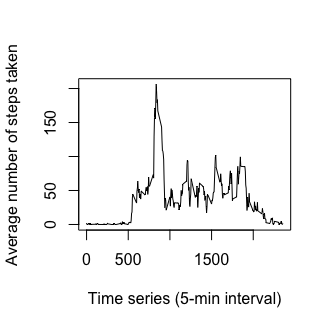
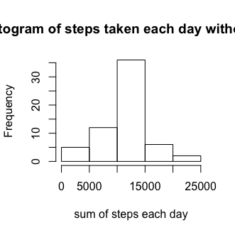
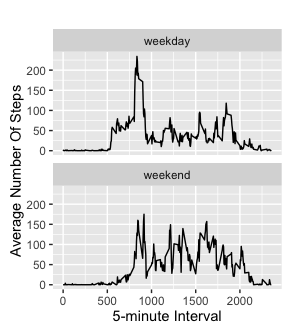

```{r setup, include=FALSE}
knitr::opts_chunk$set(echo = TRUE)
```

## Reproducible Data Assignment 1

This assignment will be described in multiple parts. You will need to write a report that answers the questions detailed below. Ultimately, you will need to complete the entire assignment in a single R markdown document that can be processed by knitr and be transformed into an HTML file.

Steps that I took:

I Forked/cloned the GitHub repository created for this assignment.

<https://github.com/rdpeng/RepData_PeerAssessment1>.

I unzipped and loaded the Activity monitoring data into a format suitable for this analysis with the following command in R.

```{r cars}
echo = TRUE
setwd("~/Desktop/Coursera/Reproducible_data/")
activity <- NULL
activity <- read.csv("activity.csv", header = T, sep = ",")
```

####What is mean total number of steps taken per day?

For this part of the assignment, you can ignore the missing values in the dataset.

Calculate the total number of steps taken per day

Sum steps for each day 

```{r cars}
sum_ea_day <- NULL
echo = TRUE
sum_ea_day <- tapply(activity$steps, activity$date, sum, na.rm=T)
```

Make a histogram of the total number of steps taken each day
```{r cars}
echo = TRUE
hist(sum_ea_day, xlab = "sum of steps each day", main = "Histogram of steps taken each day")
```
save file as histogram1.png

 

Calculate and report the mean and median of the total number of steps taken per day

```{r cars}
echo = TRUE
mean_sum_ea_day <- round(mean(sum_ea_day))
median_sum_ea_day <- round(median(sum_ea_day))
print(c("The mean is",mean_sum_ea_day))
print(c("The median is",median_sum_ea_day))
```

```r
[1] The mean is 9354
[2] The median is 10395
```

####What is the average daily activity pattern?

Make a time series plot (i.e. 𝚝𝚢𝚙𝚎 = "𝚕") of the 5-minute interval (x-axis) and the average number of steps taken, averaged across all days (y-axis)

```{r cars}
echo = TRUE
time_series <- tapply(activity$steps, activity$interval, mean, na.rm=T)
plot(time_series ~ unique(activity$interval), type="l", xlab = "Time series (5-min interval)", ylab = "Average number of steps taken")
```

save file as time_series.png

 


Which 5 minute interval on average across all the days in the dataset, contains the maximum number of steps?

```{r cars}
echo = TRUE
time_series[which.max(time_series)]
```

```r
835 
206.1698 
```

####Imputing missing values

Calculate and report the total number of missing values in the dataset ie the total number of rows with NAs

```{r cars}
echo = TRUE
table(is.na(activity) == TRUE)
```

```r
FALSE  TRUE 
50400  2304 
```
Thus there are 2304 missing values in the dataset

Devise a strategy for filling in all of the missing values in the dataset. The strategy does not need to be sophisticated. For example, you could use the mean/mean for that day, or the mean for that 5-minute interval etc.
Create a new dataset that is equal to the original dataset but with the missing data filled in

```{r cars}
echo = TRUE
# create loop that fills in where NAs exist
activitynas <- activity  # dataset without NAs
for (i in 1:nrow(activity)){
    if(is.na(activity$steps[i])){
        activitynas$steps[i]<- time_series[[as.character(activity[i, "interval"])]]
    }
}
```


Make a histogram of the total number of steps taken each day and calculate and report the mean and median total number of steps taken per day. Do these values differ from the estimates from the first part of the assignment? What is the impact of imputing missing data on the estimates of the total daily number of steps?

Sum steps for each day for new dataset without NAs

```{r cars}
sum_ea_day_nas <- NULL
echo = TRUE
sum_ea_day_nas <- tapply(activitynas$steps, activitynas$date, sum, na.rm=T)
```

```{r cars}
echo = TRUE
hist(sum_ea_day_nas, xlab = "sum of steps each day", main = "Histogram of steps taken each day without NAs")
```

Save file as histogram2.png

 

```{r cars}
echo = TRUE
mean_sum_ea_day_nas <- round(mean(sum_ea_day_nas))
median_sum_ea_day_nas <- round(median(sum_ea_day_nas))
print(c("The mean is",mean_sum_ea_day_nas))
print(c("The median is",median_sum_ea_day_nas))
```

```r
[1] The mean is 10766
[2] The median is 10766
```
Yes, these values differ from the estimates from the first part of the assignment 
The impact of inputing missing data on the estimates of the total daily number of steps results in an increase in the mean and median


####Are there differences in activity patterns between weekdays and weekends?

For this part the 𝚠𝚎𝚎𝚔𝚍𝚊𝚢𝚜() function may be of some help here. Use the dataset with the filled-in missing values for this part.

Create a new factor variable in the dataset with two levels – “weekday” and “weekend” indicating whether a given date is a weekday or weekend day.


```{r cars}
echo = TRUE
activitynas$weekdayType <- ifelse(weekdays(activitynas$date) %in% c("Satuday", "Sunday"), 
    "Weekend", "Weekday")

head(activitynas)
```

```r
      steps       date interval weekday
1 1.7169811 2012-10-01        0 weekday
2 0.3396226 2012-10-01        5 weekday
3 0.1320755 2012-10-01       10 weekday
4 0.1509434 2012-10-01       15 weekday
5 0.0754717 2012-10-01       20 weekday
6 2.0943396 2012-10-01       25 weekday
```

Make a panel plot containing a time series plot (i.e. 𝚝𝚢𝚙𝚎 = "𝚕") of the 5-minute interval (x-axis) and the average number of steps taken, averaged across all weekday days or weekend days (y-axis). See the README file in the GitHub repository to see an example of what this plot should look like using simulated data.


```{r cars}
echo = TRUE
activity$date <- as.Date(activity$date, "%Y-%m-%d")
activity$day <- weekdays(activity$date)
activity$type_of_day <- c("weekday")

# in a loop determine of day is a weekend
for (i in 1:nrow(activity)){
  if (activity$day[i] == "Saturday" || activity$day[i] == "Sunday"){
    activity$type_of_day[i] <- "weekend"
  }
}

activity$daytype <- as.factor(activity$type_of_day)
table_with_steps <- aggregate(steps ~ interval+type_of_day, activity, mean)

library(ggplot2)

qplot(interval, steps, data=table_with_steps, geom=c("line"), xlab="5-minute Interval", ylab="Average Number Of Steps", main="") + facet_wrap(~ type_of_day, ncol=1)
```

Save the file as panelplot.png

 


